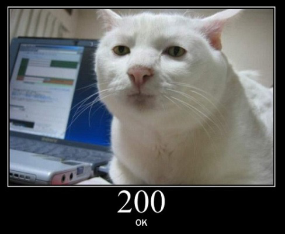
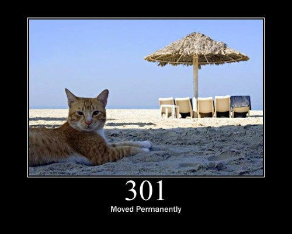
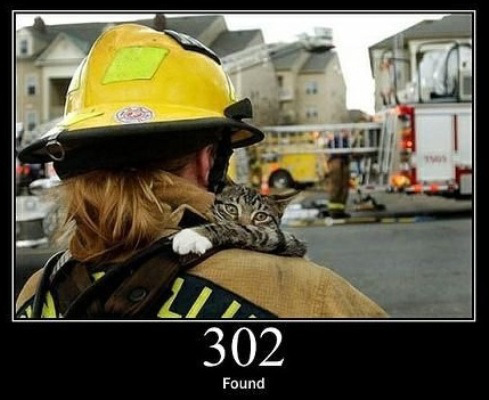
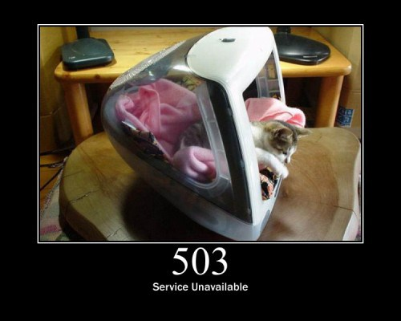
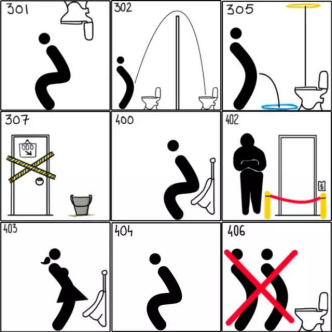
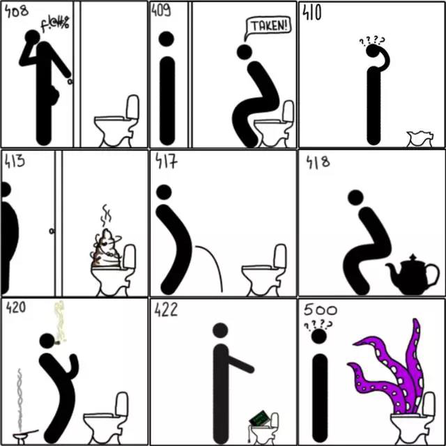
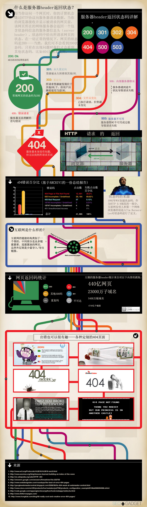

HTTP状态码
===================

## 状态码定义 ##

 - 标准定义
> HTTP状态码（HTTP Status Code）是用以表示网页服务器HTTP响应状态的3位数字代码。所有状态码的第一个数字代表了响应的五种状态之一。

 - 情境定义
> 当浏览者访问一个网页时，浏览者的浏览器会向网页所在服务器发出请求。当浏览器接收并显示网页前，此网页所在的服务器会返回一个包含HTTP状态码的信息头（server header）用以响应浏览器的请求。

## 状态码分类 ##
分类   | 分类描述  
-------  | -----------  
1** | 信息，服务器收到请求，需要请求者继续执行操作
2** | 成功，操作被成功接收并处理
3** | 重定向，需要进一步的操作以完成请求
4** | 客户端错误，请求包含语法错误或无法完成请求
5** | 服务器错误，服务器在处理请求的过程中发生了错误

### 1**状态码介绍 ###
 状态码   |  名称 | 描述  
-------  | ------ | -----  
100 | 继续 | 信息，服务器收到请求，需要请求者继续执行操作
101 | 切换协议 | 表示请求方已经要求服务器切换协议，并且服务器已经接受并会进行处理。

### 2**状态码介绍 ###
 状态码   |  名称 | 描述  
-------  | ----- | ------  
200  |  成功    | 一般用于GET与POST请求
201  |  已创建  |  成功请求并创建了新的资源
202  |  接受  |   已经接受请求，但未处理完成
203   | 非授权信息     | 请求成功。但返回的meta信息不在原始的服务器，而是一个副本
204   | 无内容   | 服务器成功处理，但未返回内容。在未更新网页的情况下，可确保浏览器继续显示当前文档
205   | 重置内容      | 服务器处理成功，用户终端（例如：浏览器）应重置文档视图。可通过此返回码清除浏览器的表单域
206   | 部分内容      | 服务器成功处理了部分GET请求

### 3**状态码介绍 ###
 状态码   |  名称 | 描述  
-------  | ------ | -----  
300  | 多种选择  | 请求的资源可包括多个位置，相应可返回一个资源特征与地址的列表用于用户终端（例如：浏览器）选择
301  | 永久移动  | 请求的资源已被永久的移动到新URI，返回信息会包括新的URI，浏览器会自动定向到新URI。今后任何新的请求都应使用新的URI代替
302  | 找到    | 与301类似。但资源只是临时被移动。客户端应继续使用原有URI
303  | 查看其它地址    | 与301类似。使用GET和POST请求查看
304  | 未修改   | 所请求的资源未修改，服务器返回此状态码时，不会返回任何资源。客户端通常会缓存访问过的资源，通过提供一个头信息指出客户端希望只返回在指定日期之后修改的资源
305  | 使用代理  | 所请求的资源必须通过代理访问
306  | 未使用   | 已经被废弃的HTTP状态码
307  | 临时重定向     | 与302类似。使用GET请求重定向

### 4**状态码介绍 ###
 状态码   |  名称 | 描述  
-------  | ------ | -----  
400  | 错误请求  | 客户端请求的语法错误，服务器无法理解
401  | 未授权   | 请求要求用户的身份认证
402  | 需要支付  | 保留，将来使用
403  | 禁止    | 服务器理解请求客户端的请求，但是拒绝执行此请求
404  | 未找到   | 服务器无法根据客户端的请求找到资源（网页）。通过此代码，网站设计人员可设置"您所请求的资源无法找到"的个性页面
405  | 方法不允许     | 客户端请求中的方法被禁止
406 |无法访问   |服务器无法根据客户端请求的内容特性完成请求
407 |代理身份验证 |请求要求代理的身份认证，与401类似，但请求者应当使用代理进行授权
408 |请求超时   |服务器等待客户端发送的请求时间过长，超时
409 |冲突 |服务器完成客户端的PUT请求是可能返回此代码，服务器处理请求时发生了冲突
410 |已删除    |客户端请求的资源已经不存在。410不同于404，如果资源以前有现在被永久删除了可使用410代码，网站设计人员可通过301代码指定资源的新位置
411 |需要数据长度 |服务器无法处理客户端发送的不带Content-Length的请求信息
412 |先决条件错误 |客户端请求信息的先决条件错误
413 |请求实体过大 |由于请求的实体过大，服务器无法处理，因此拒绝请求。为防止客户端的连续请求，服务器可能会关闭连接。如果只是服务器暂时无法处理，则会包含一个Retry-After的响应信息
414 |请求URI过长    |请求的URI过长（URI通常为网址），服务器无法处理
415 |不支持的媒体格式   |服务器无法处理请求附带的媒体格式
416  |请求范围不符合要求 |客户端请求的范围无效
417 |期望失败   |服务器无法满足Expect的请求头信息

### 5**状态码介绍 ###
 状态码   |  名称 | 描述  
-------  | ------ | -----  
500  | 服务器内部错误   | 服务器内部错误，无法完成请求
501  | 不可执行  | 服务器不支持请求的功能，无法完成请求
502   | 错误网关     | 充当网关或代理的服务器，从远端服务器接收到了一个无效的请求
503  | 服务不可用     | 由于超载或系统维护，服务器暂时的无法处理客户端的请求。延时的长度可包含在服务器的Retry-After头信息中
504  | 网关超时  | 充当网关或代理的服务器，未及时从远端服务器获取请求
505  | HTTP 版本不支持    | 服务器不支持请求的HTTP协议的版本，无法完成处理

## 常见状态码详解 ##

 - 200

> 正常情况下请求一个网址都会返回200状态码，说明请求网页成功，对于搜索引擎来讲，只要看到200状态码，就会认为该网址正常，是收录的必要条件。

 - 301
 

> 永久重定向。我们经常碰到这样的情况，比如要更换域名，那么老域名的所有网址都要转向到新域名对应的网址，这个时候就必须通过301永久重定向到新的域名，意思是告诉搜索引擎，我之前的域名已经不用了，永久的转到了新的域名，那么搜索引擎看到301状态码后就会删除旧的页面而重新收录新的页面，这样的话，即使更换了域名，也不用担心搜索引擎对新域名不收录，反而收录的非常快，同样旧域名的PR也会跟着永久转到新域名上，搜索引擎的对301状态码的反应来看，Google最快，百度稍慢。

 - 302
 

> 临时重定向。我们有时候会碰到这样的情况，比如要查看的内容需要登录后才能查看，这时候用户点击的时候需要跳转到登录页面让用户登录，那么这里面的跳转就
> 必须用302状态码来跳转这样搜索引擎会认为，这个链接只是临时的跳转，并不是说这个链接已经无效了，所以之后搜索引擎会继续尝试访问这个链接的内容，也许哪天这个页面的内容不需要登录即可查看，那么搜索引擎就会很快收录。

 - 404
 

>  页面找不到。这个非常重要，比如我的分类信息网，经常要删除一些过期信息，那么删除后在访问这个页面的时候就必须返回404状态码，而不是跳转到首页，或者返回其他状态码，这样搜索引擎就会认为这个页面已经不存在了，就会删除这个页面，如果返回200状态码，搜索引擎会认为这个网址仍然有效，会不断地尝试访问，但如果每次都是无法访问的时候，可想而知对网站来说是非常不利的。

 - 503
 

>  服务暂时不可用。这个非常重要，做网站总是要定期对网站进行维护，对于有些比较重大的维护可能是需要中断访问的（如发现重大漏洞，升级等），尤其是对于我们这种草根网站更是难以避免，这个时候503就派上用场了，在用户访问网站得时候直接返回503状态码，说明服务器正在维护即可，这样搜索引擎看到503
> 后就会知道网站可能是负载太大或者正在维护而暂时不能访问，搜索引擎就会过段时间再访问，对于网站来说虽然网站无法访问了，但搜索引擎知道是怎么回事，更
> 不会对搜索引擎产生任何影响，当然返回503也不能太频繁。

## 状态码图解 ##

注释：
 - 301—永久移动。被请求的资源已被永久移动位置；
 - 302—请求的资源现在临时从不同的 URI 响应请求；
 - 305—使用代理。被请求的资源必须通过指定的代理才能被访问；
 - 307—临时跳转。被请求的资源在临时从不同的URL响应请求；
 - 400—错误请求；
 - 402—需要付款。该状态码是为了将来可能的需求而预留的，用于一些数字货币或者是微支付；
 - 403—禁止访问。服务器已经理解请求，但是拒绝执行它；
 - 404—找不到对象。请求失败，资源不存在；
 - 406—不可接受的。请求的资源的内容特性无法满足请求头中的条件，因而无法生成响应实体；
 

注释：
 - 408—请求超时；
 - 409—冲突。由于和被请求的资源的当前状态之间存在冲突，请求无法完成；
 - 410—遗失的。被请求的资源在服务器上已经不再可用，而且没有任何已知的转发地址；
 - 413—响应实体太大。服务器拒绝处理当前请求，请求超过服务器所能处理和允许的最大值；
 - 417—期望失败。在请求头 Expect 中指定的预期内容无法被服务器满足；
 - 418—我是一个茶壶。超文本咖啡罐控制协议，但是并没有被实际的HTTP服务器实现；
 - 420—方法失效；
 - 422—不可处理的实体。请求格式正确，但是由于含有语义错误，无法响应；
 - 500—服务器内部错误。服务器遇到了一个未曾预料的状况，导致了它无法完成对请求的处理；
